# Student-Faculty-Interaction-Portal
Open Source Project 

This is a Student Teacher Management System Made using Php . This Uses Bootstrap as a front-end framework .
To Test the Project On your System . 
1. Clone The Repo and place the folder in one of the following directories  (/opt/lampp/htdocs) Or (C:/xampp/htdocs)
2. Run the Xampp Server Along the Apache and Maria/MySql DB .
3. Rename the folder as Project For Simple Naviagation.
4. Once Apache is up and Running navigate to localhost/Project
5. The index.html page will be loaded Automatically

# Features 
It offers 2 views a student view and a teacher view . The Student can put all of his personal and
academic records and then send it for further validation . 
The faculty view offers to change and update any of the student information if he/she finds it 
incorrect . 

# Screenshots

  <b> Home Page </b>
        
  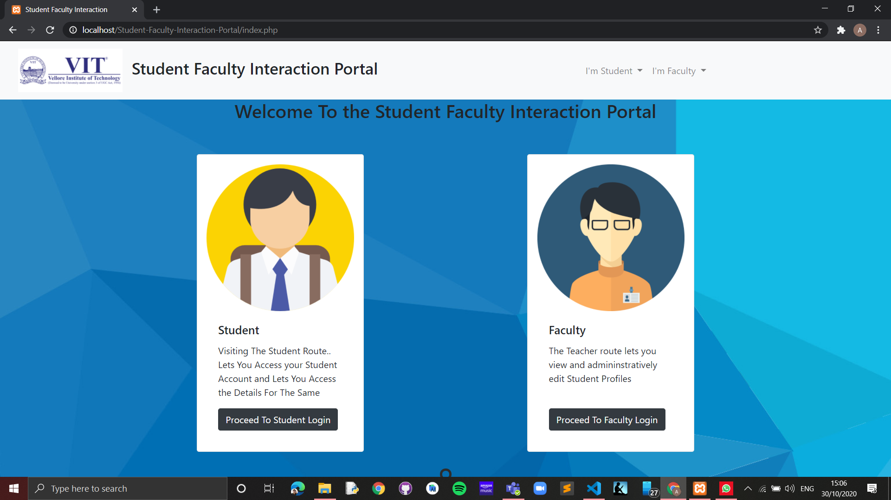

  <b> Student Login </b>
        
  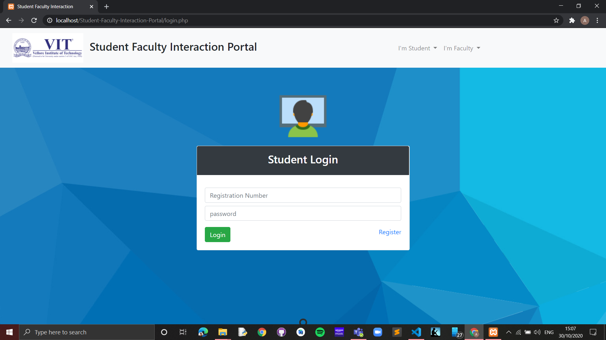

  <b> Faculty Login </b>
        
  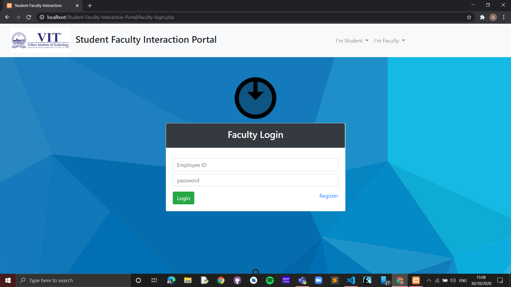

  <b> Faculty Register </b>
        
  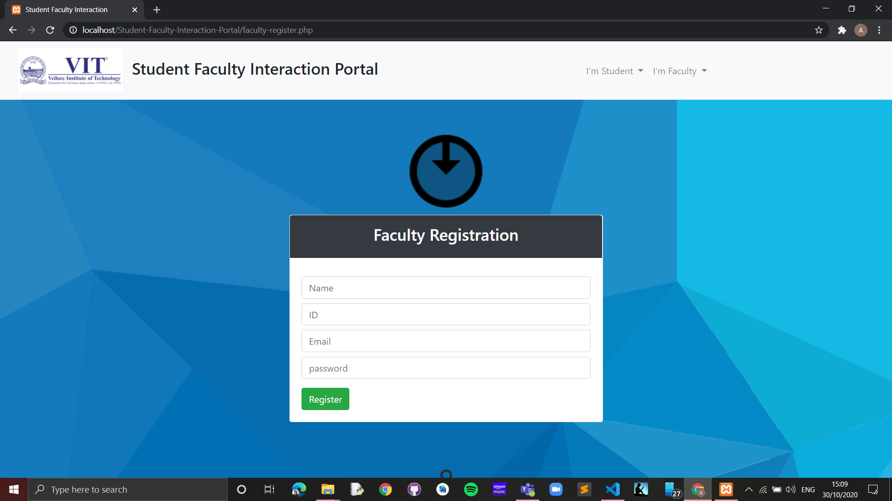

  <b> Student Register </b>
        
  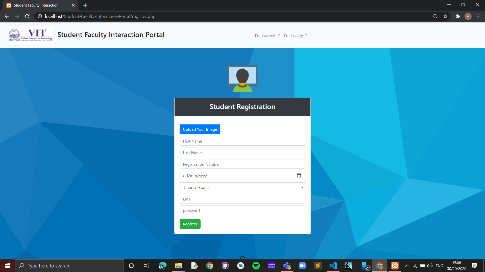

  <b> Student Dashboard </b>
        
  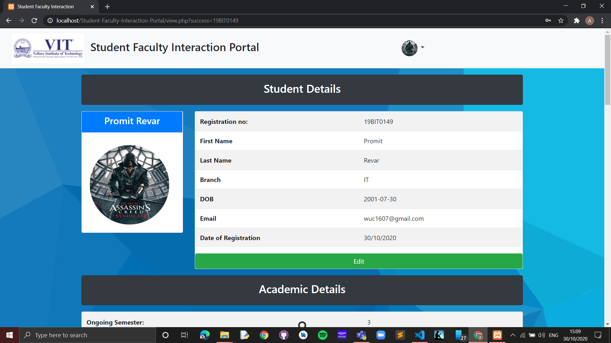

  <b> Projects and Interships of Students </b>
        
  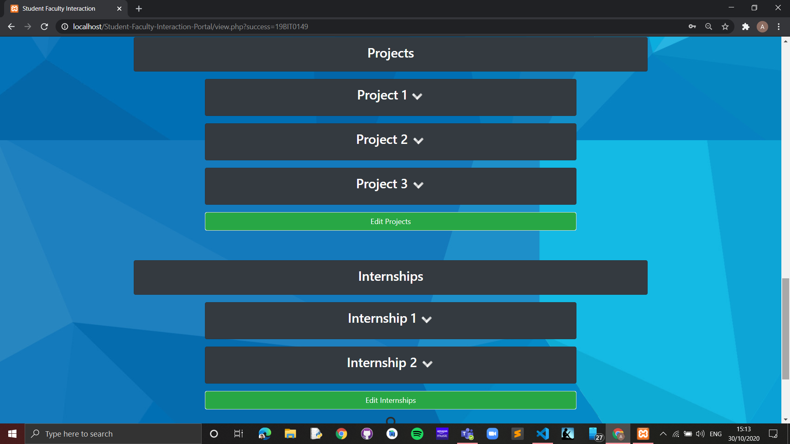

  <b> Projects of Students </b>
        
  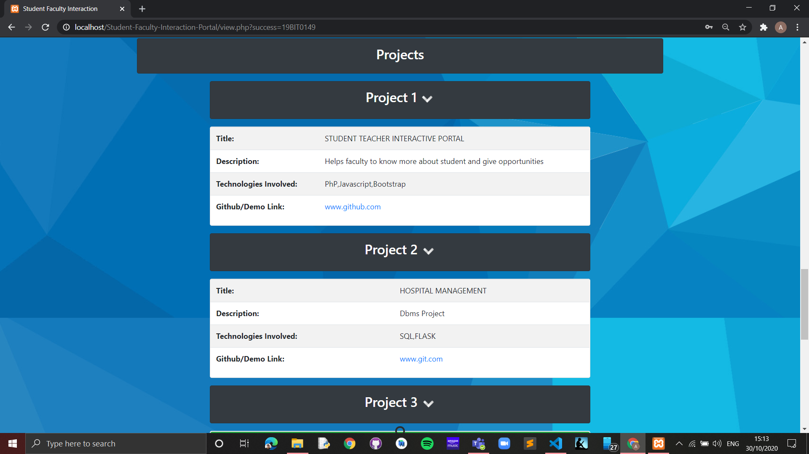

  <b> LOR  </b>
        
  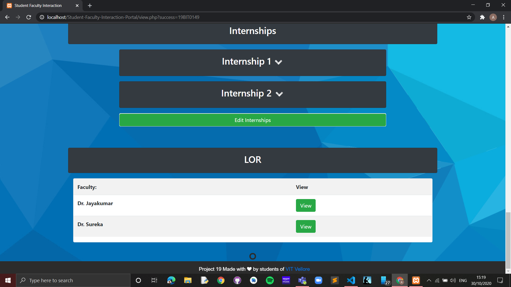

  <b> LOR View </b>
        
  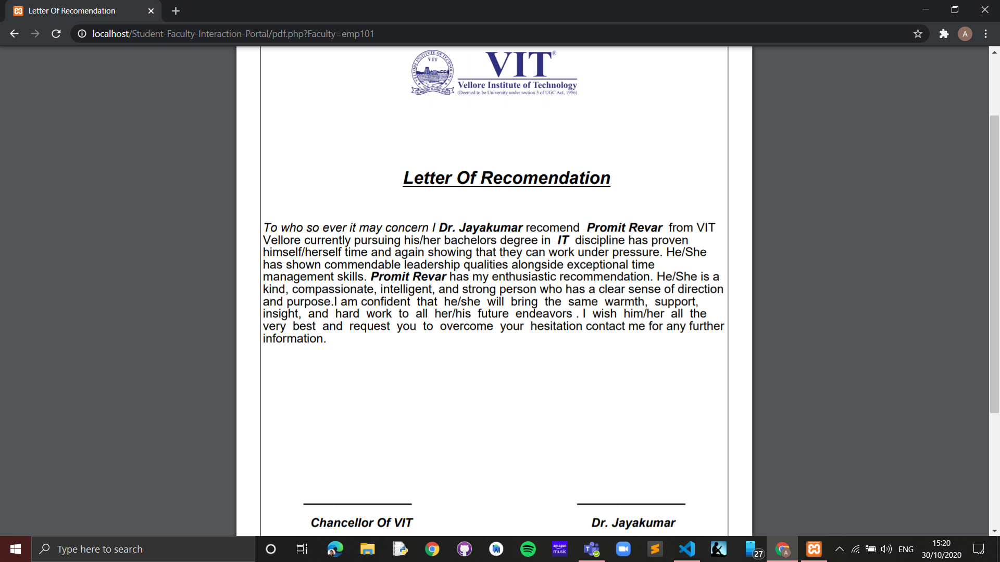

  <b> Faculty Dashboard </b>
        
  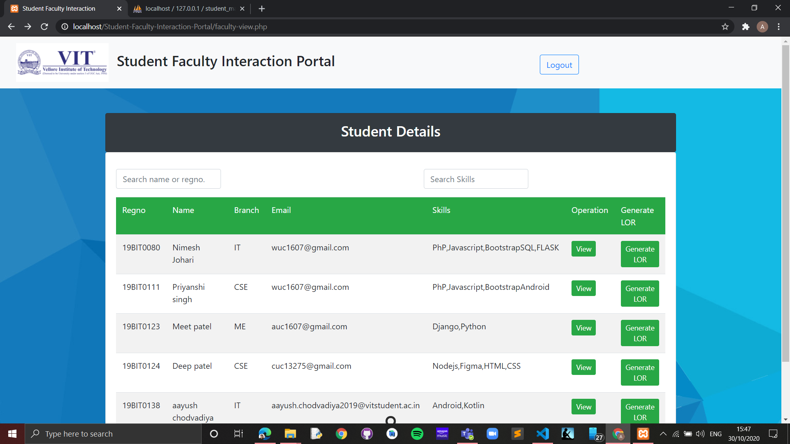

